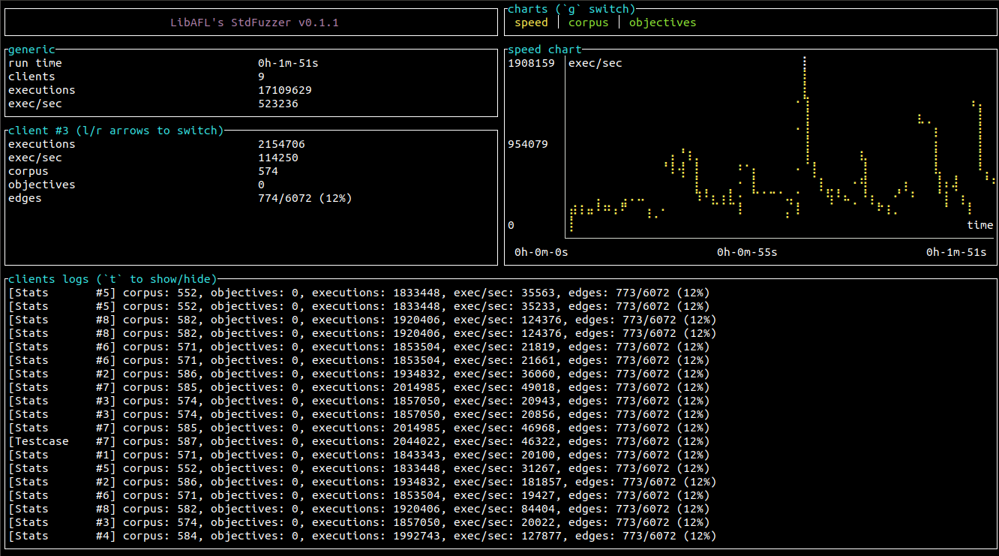

# StdFuzzer

# **Deprecated! This has not been maintained in a while. Instead. check out [the example fuzzers in the main LibAFL repo](https://github.com/AFLplusplus/LibAFL/tree/main/fuzzers)**

StdFuzzer is the reference implementation of a generic source-based bit-level fuzzer with LibAFL



## Building

Build with

```
$ cargo build --release
```

## Compiling a target

Compile a target setting the compiler wrappers for C and C++ as compilers in the build system.

For instance:

```
$ CC=/path/to/StdFuzzer/target/build/libafl_cc CXX=/path/to/StdFuzzer/target/build/libafl_cxx ./configure
$ make
```

This fuzzer assumes that the target is exporting a LibFuzzer harness (`LLVMTestOneInput`).

## Run the fuzzer

Take the output harness binary and execute with -h to see the required command line:

```
$ ./harness -h
StdFuzzer 0.1.0
Andrea Fioraldi <andreafioraldi@gmail.com>
StdFuzzer is the reference implementation of a generic bit-level fuzzer with LibAFL

USAGE:
    harness [OPTIONS] --cores <CORES> --broker-port <PORT>

FLAGS:
    -h, --help       Prints help information
    -V, --version    Prints version information

OPTIONS:
    -c, --cores <CORES>                  Spawn a client in each of the provided cores. Broker runs in the 0th core.
                                         'all' to select all available cores. 'none' to run a client without binding to
                                         any core. eg: '1,2-4,6' selects the cores 1,2,3,4,6.
    -i, --input <INPUT>...               Set an initial corpus directory
    -o, --output <OUTPUT>                Set the output directory, default is ./out [default: ./out]
    -p, --broker-port <PORT>             Choose the broker TCP port, default is 1337
    -a, --remote-broker-addr <REMOTE>    Specify a remote broker
    -t, --timeout <TIMEOUT>              Set the exeucution timeout in milliseconds, default is 1000 [default: 1000]
    -x, --tokens <TOKENS>...             Feed the fuzzer with an user-specified list of tokens (often called
                                         "dictionary"
```


